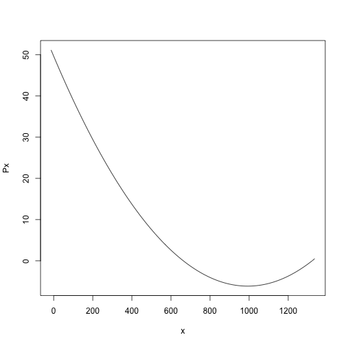

## The result of our analysis is a quadratic curve

$y = 49.667 - 0.112x + 0.0000566x^2$

Using this predictive function, we will be able to predict the survival time
for any arbitrary dose of radiation with a 95% confidence level

---

## 

<b> This newfound ability to predict survival for untested doses gives us many benefits:</b>

 

> - Reduces need for laboratory rats
> - Reduces unnecessary exposure for research personnel to radiation
> - Saves time and money

--- &twocol

## Summary of Analytic Results

*** =left
Raw data, from Rat Radiation Experiment

 

*** =right
Linear model, quadratic degree, fitted to data
 
*** =fullwidth
---

